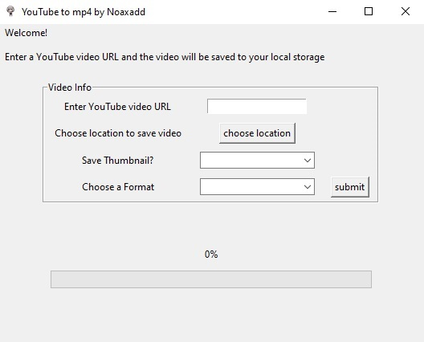
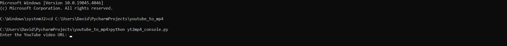
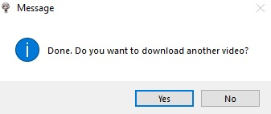

# YouTube Video Downloader

---



### Overview

---

This program allows you to download the video and thumbnail of a YouTube video.
This program uses [pytube](https://github.com/pytube/pytube) to save the video 
and [pythumb](https://github.com/alexitx/pythumb) to save the thumbnail. 

There is also a different version of this program that allows you to use it in the command line.


### Features 

---

* download a YouTube video to the highest resolution
* option to download the thumbnail of the video
* choose location of where you want to save the files

### How to Set Up GUI App

---

Once you have downloaded the folder, store it where ever you want. 
However, make sure to keep the files on same location. Otherwise, you will encounter an error. 
You can make a shortcut of the .exe file and move that shortcut outside the folder if you want.

### How to Set Up Command Line Program

---

On my [github repo](https://github.com/DavidKN10/yt-video-downloader), download "yt2mp4_console.py"

Make sure you also have [python](https://www.python.org/downloads/), pytube, and pythumb installed.

Instructions to download pythumb and pytube:

```commandline
C:\Windows\system32>pip install pytube
```

```commandline
C:\Windows\system32>pip install pythumb
```

Once you have everything installed, open the command line. Once there, 
change to the directory of where the "yt2mp4_console.py" is saved.

```commandline
C:\Windows\system32>cd (directory of where ytmp4_console.py is saved)
```

Now open the pyton file in the command line:
```commandline
C:(directory)>python yt2mp4_console.py
```
The python file should now be open and you can start downloading videos.



### How to Use the GUI App

---

In the entry box next to "Enter YouTube video URL", place the URL to the video.
On the button that says "choose location", a window will open,
and you can go to the folder where you want to save the video. 
Next to "Save Thumbnail?" you will see a dropdown menu that will give you the options
"Yes" and "No". If "Yes" is chosen, the thumbnail will be saved on the same location 
where you are saving the video. If "No" is chosen, the thumbnail will not be saved. 

When you click on "submit", the video and thumbnail will start downloading.

Once the video downloads, you will get the following window:



If you click "Yes", the message window will close and you can continue downloading more videos.
If you click "No", the message box will close and you will exit the program.

### How to Use the Command Line Program

---

You will first be prompted to enter the URL of the video:
```commandline
Enter the YouTube video URL: (URL goes here)
```
Copy and paste the URL and hit enter. 
Now you will be prompted to enter the directory to save the file.
```commandline
Enter the YouTube video URL: (URL goess here)
Enter the path to save the video: (path goes here)
```
After entering the save path, you will be asked if you want to save the thumbnail.
If you type "Y" or "y", the thumbnail will be saved. You can type anything else to decline.
```commandline
Enter the YouTube video URL: (URL goess here)
Enter the path to save the video: (path goes here)
Do you want to save the thumbnail? (Y/N):
```
After entering yor option, the console will print out the name of the video with invalid characters removed. 
Then the console will tell you if the video and thumbnail were downloaded successfully. 
If the video did not download successfully, it will tell you what error it encountered. 
```commandline
Enter the YouTube video URL: (URL goess here)
Enter the path to save the video: (path goes here)
Do you want to save the thumbnail? (Y/N):
Video Title: (title will be printed here)
Video downloaded successfully! Saved as '(name of video)'
Thumbnail downloaded successfully! Saved as '(name of image)'
```
